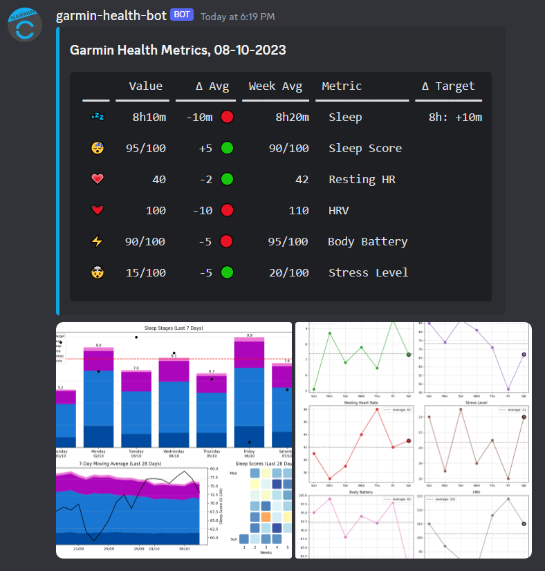

# garmin-connect-discordbot

[](https://github.com/holstt/garmin-connect-discordbot/actions/workflows/ci.yml)
[](https://www.python.org)
[](https://python-poetry.org/)
[](https://github.com/psf/black)
[](https://microsoft.github.io/pyright/)

Discord bot providing a daily summary of your Garmin Connect health metrics



_NB: Synthetic data generated for demonstration purposes - may contain inconsistencies_

## Features

-   Get daily summary as soon as yesterday's metrics become available on Garmin Connect (i.e. when your Garmin device has synced with the phone)
-   Monitor metrics: Currently supports Sleep, Sleep Score, Resting HR, HRV, Body Battery and Stress Level. Include all or only a subset of the metrics
-   Spot trends: Compares the most recent metric value to its weekly average
-   Visualize Progress:
    -   Sleep chart: 7-day bar plot of sleep stages and sleep scores, 4-week stacked area chart with 7-day moving average of sleep stages and sleep scores, 4-week waffle chart with sleep score color gradient
    -   Metrics chart: Small 7-day bar plots of each metric
-   Docker support: Easy deployment using Docker Compose including scripts for a more secure setup in production environments

**TODO:**

-   [ ] Add and vizualize activity e.g. using intensity minutes, activity frequency/duration etc.
-   [ ] End of week summary with activity overview, weekly distance, frequency for each activity etc. Could also include metrics and be an alternative to the daily summary to reduce notifications
-   [ ] Data analysis: Provide insights into trends and correlations between metrics
-   [ ] Support two-factor authentication

## Requirements

-   A [Garmin Connect](https://connect.garmin.com/) account and a Garmin device to collect the data
-   A [Discord webhook URL](https://support.discord.com/hc/en-us/articles/228383668-Intro-to-Webhooks) (interaction with the bot is not relevant with current feature set, so we don't need to create a bot account)
-   (Only if running locally) The [Poetry package manager](https://python-poetry.org/docs/#installation)
-   (Only if running with Docker) [Docker](https://docs.docker.com/get-docker/) and [Docker Compose](https://docs.docker.com/compose/install/)

## Getting Started

**1. Clone the repository**:

```bash
git clone https://github.com/holstt/garmin-health-discordbot.git
cd garmin-health-discordbot
```

**2. Set up configuration**

The bot is configured using environment variables. Defining environment variables using a `.env` file is supported - place it in the root of the project directory or provide a custom path using the `-e` flag (see further below). The `.env.example` file can be used as a template (remember to rename it to `.env`).

Important notes about configuration:

-   If your watch only supports a subset of metrics, the included metrics can be configured using the `METRICS` variable. Else, the program will wait forever for these metrics to be uploaded on Garmin Connect
-   Garmin credentials can be provided as environment variables or entered at program startup
-   Session data is not persisted by default, but can be set using `SESSION_FILE_PATH` (recommended)

The table below provides an overview of all available configuration options.

| Variable Name           | Required | Description                                                                                                                                                                                                                                                                                                                                                                                                                                                                           | Default Value     | Accepted Format/Type                                                                                                                  | Example Value                                                               |
| ----------------------- | -------- | ------------------------------------------------------------------------------------------------------------------------------------------------------------------------------------------------------------------------------------------------------------------------------------------------------------------------------------------------------------------------------------------------------------------------------------------------------------------------------------- | ----------------- | ------------------------------------------------------------------------------------------------------------------------------------- | --------------------------------------------------------------------------- |
| `WEBHOOK_URL`           | Yes      | URL for the Discord webhook that should receive the daily health summary.                                                                                                                                                                                                                                                                                                                                                                                                             |                   | URL                                                                                                                                   | `https://discordapp.com/api/webhooks/1234567890/abcdefghijklmnopqrstuvwxyz` |
| `NOTIFY_TIME_OF_DAY`    | Yes      | The time when the daily health summary should be sent to the Discord webhook. **NB: If data for today is not available yet, the program will keep scheduling a retry 30-60 minutes later until the data becomes available.**                                                                                                                                                                                                                                                          |                   | `HH:MM`                                                                                                                               | `06:00`                                                                     |
| `SESSION_FILE_PATH`     | No       | Path to the session directory location. If provided, the Garmin session data will be saved to this location after successful login. If session data already exists in this directory (e.g., from a previous run), it will be reused if still valid. If no path is specified, the session will only be stored in memory. Please note that if the session is not persisted and you repeatedly restart the program, you may experience rate limiting issues due to logging in too often. | `None`            | Filesystem Path                                                                                                                       | `path/to/session/directory`                                                 |
| `METRICS`               | No       | The metrics to include in the daily update, specified in the order they should be listed in the message. The sleep analysis plot will not be created if `sleep` and/or `sleep_score` are not in the list                                                                                                                                                                                                                                                                              | (all metrics)     | Json array of metrid ids. Options: `sleep`, `sleep_score`, `resting_hr`, `hrv`, `body_battery`, `stress_level`                        | ["sleep", "sleep_score", "hrv", "stress"]                                   |
| `MESSAGE_FORMAT`        | No       | The message format to use for the daily health summary. The `lines` format is better suited for mobile devices.                                                                                                                                                                                                                                                                                                                                                                       | `lines`           | Options: `lines` [see example](docs/discord_message_example_lines.png), `table` [see example](docs/discord_message_example_table.png) |                                                                             |
| `WEBHOOK_ERROR_URL`     | No       | Discord webhook URL that should receive an error message in case of any unhandled exceptions (can be the same as `WEBHOOK_URL`). This includes any unhandled exceptions caught by the scheduler. If not provided, no error notifications will be sent.                                                                                                                                                                                                                                | `None`            | URL                                                                                                                                   | `https://discordapp.com/api/webhooks/1234567890/abcdefghijklmnopqrstuvwxyz` |
| `TIME_ZONE`             | No       | The IANA time zone in which the `NOTIFY_TIME_OF_DAY` is specified.                                                                                                                                                                                                                                                                                                                                                                                                                    | (local time zone) | [IANA Time Zone](https://en.wikipedia.org/wiki/List_of_tz_database_time_zones)                                                        | `Europe/Berlin`                                                             |
| `CREDENTIALS__EMAIL`    | No       | Garmin Connect email. If not provided, you will be prompted to enter it at program startup.                                                                                                                                                                                                                                                                                                                                                                                           | `None`            | Email Address                                                                                                                         | `my@email.com`                                                              |
| `CREDENTIALS__PASSWORD` | No       | Garmin Connect password. If not provided, you will be prompted to enter it at program startup.                                                                                                                                                                                                                                                                                                                                                                                        | `None`            | String                                                                                                                                | `mypassword`                                                                |

## Local Installation 💻

**3. Install the dependencies and create a virtual environment**

```bash
poetry install
```

**4. Activate the virtual environment**

```bash
poetry shell
```

**5. Run the bot**

```bash
python ./main.py
```

-   If you use an `.env` file to configure the environment, the program assumes it is placed in the root of the project folder. Alternatively, you can provide a custom path for your environment file using `./main.py -e path/to/env`

## Docker 🐳

**3. From project root, navigate to the `./docker` folder**

```bash
cd docker
```

**4. Option 1: Run the Docker Compose project with restrictive permissions**

`./docker` includes convenient scripts to simplify setting up and running the Docker container with `docker.dev.sh` and `docker.prod.sh` being the entrypoints. These scripts handle the creation of a dedicated Docker user, a container data directory on the host, and apply restrictive permissions on the data directory and environment file before running the container. Inspect the configuration in the scripts, and verify that the assumed host paths match your file structure.

Then run the script for your environment, e.g.:

```bash
./docker.prod.sh
```

**4. Option 2: Run the Docker Compose project without restrictive permissions**
For a less restrictive/simpler setup, you can edit and use the `docker-compose.yml` file directly. Replace the environment variables for the volume paths with concrete values matching your file structure and remove the `user` property to run the container as root. Then in the Dockerfile, remove the original `ENTRYPOINT` instruction and uncomment the simple `ENTRYPOINT` instruction that does not prevent the container from running as root.

Then run:

```bash
docker-compose up --build
```

or to keep it running in the background:

```bash
docker-compose up -d --build && docker-compose logs -f
```
