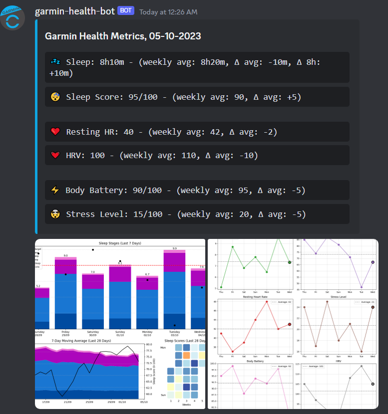

# garmin-health-discordbot

Discord bot providing a daily summary of your Garmin Connect health metrics



## Features

- Get daily summary as soon as yesterday's metrics become available on Garmin Connect (i.e. when your Garmin device has synced with the phone)
- Monitor metrics: Currently includes Sleep, Sleep Score, HRV
- Spot trends: Compares the most recent metric value to its weekly average
- Docker support: Easy deployment using Docker Compose including scripts for a more secure setup in production environments


#### Todo:
- [ ] Add more metrics
  - [ ] Heart rate
  - [ ] Body battery
  - [ ] Steps
  - [ ] Stress Score
- [ ] Customize which metrics to include in the daily update
- [ ] End of week summary with activity overview, weekly distance, frequency for each activity etc.
- [ ] Generate chart and include as image in the daily/weekly update to visualize progress

## Requirements

- A [Garmin Connect](https://connect.garmin.com/) account and a Garmin device to collect the data
- A [Discord webhook URL](https://support.discord.com/hc/en-us/articles/228383668-Intro-to-Webhooks) (interaction with the bot is not relevant with current feature set, so we don't need to create a bot account)
- (Only if running locally) The [Poetry package manager](https://python-poetry.org/docs/#installation)
- (Only if running with Docker) [Docker](https://docs.docker.com/get-docker/) and [Docker Compose](https://docs.docker.com/compose/install/) 


## Getting Started

**1. Clone the repository**:

```bash
git clone https://github.com/holstt/garmin-health-discordbot.git
cd garmin-health-discordbot
```

**2. Set up configuration**

The bot is configured using environment variables, which can be specified in a `.env` file or set directly in the environment.

`./env.example` provides an example of the required format. Rename the file to `.env` and edit the values as needed:

```properties
# URL for the Discord webhook
WEBHOOK_URL=https://discordapp.com/api/webhooks/1234567890/abcdefghijklmnopqrstuvwxyz

# The time in format HH:MM when the daily health summary should be fetched.
# If data for today is not available yet, the program will schedule a retry at a
# later time until the data becomes available
NOTIFY_TIME_OF_DAY=06:00

# The IANA time zone in which the NOTIFY_AT_HOUR is specified.
# See https://en.wikipedia.org/wiki/List_of_tz_database_time_zones
TIME_ZONE=Europe/Berlin

# OPTIONAL: Garmin Connect credentials. If not provided, you will be prompted to
# enter them at program startup.
GARMIN_EMAIL=my@email.com
GARMIN_PASSWORD=mypassword

# OPTIONAL: Path to the session directory location. If provided, the Garmin session will be saved to disk after login.
# If a session file already exists in this directory (e.g., from a previous run), it will be reused if still valid.
# If no path is specified, the session will only be stored in memory.
# Please note that if the session is not persisted and you repeatedly restart the
# program, you might experience rate limiting issues due to logging in too often.
DATA_DIRECTORY_PATH=path/to/data/directory
```

## Local Installation 💻

**3. Install the dependencies and create a virtual environment**

```bash
poetry install
```

**4. Activate the virtual environment**

```bash
poetry shell
```

**5. Run the bot**

```bash
python ./main.py
```

- If you use an `.env` file to configure the environment, the program assumes it is placed in the root of the project folder. Alternatively, you can provide a custom path for your environment file using `./main.py -e path/to/env`

## Docker 🐳

**3. From project root, navigate to the `./docker` folder**

```bash
cd docker
```

**4. Option 1: Run the Docker Compose project with restrictive permissions**

`./docker` includes convenient scripts to simplify setting up and running the Docker container with `docker.dev.sh` and `docker.prod.sh` being the entrypoints. These scripts handle the creation of a dedicated Docker user, a container data directory on the host, and apply restrictive permissions on the data directory and environment file before running the container. Inspect the configuration in the scripts, and verify that the assumed host paths match your file structure.

Then run the script for your environment, e.g.:

```bash
./docker.prod.sh
```

**4. Option 2: Run the Docker Compose project without restrictive permissions**
For a less restrictive/simpler setup, you can edit and use the `docker-compose.yml` file directly. Replace the environment variables for the volume paths with concrete values matching your file structure and remove the `user` property to run the container as root. Then in the Dockerfile, remove the original `ENTRYPOINT` instruction and uncomment the simple `ENTRYPOINT` instruction that does not prevent the container from running as root.

Then run:

```bash
docker-compose up --build
```

or to keep it running in the background:

```bash
docker-compose up -d --build && docker-compose logs -f
```
